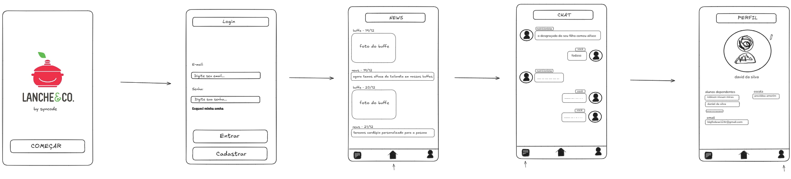
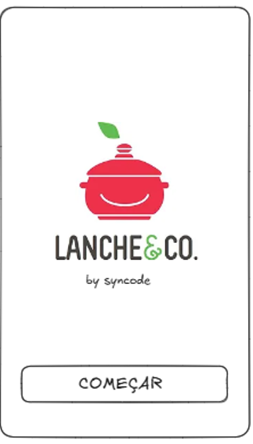
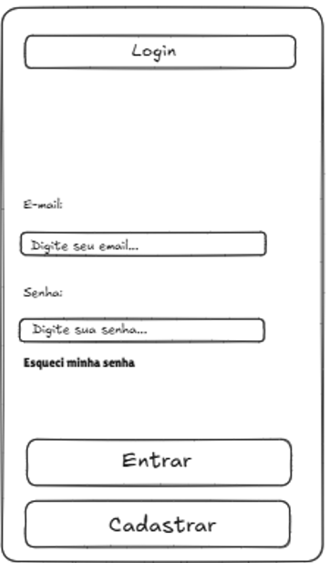
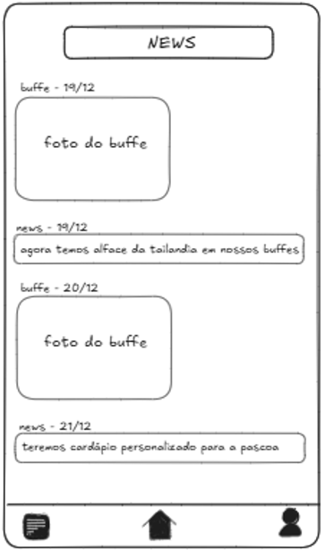
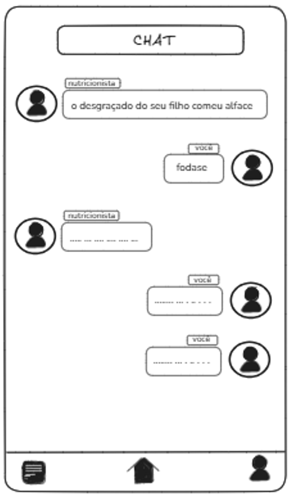
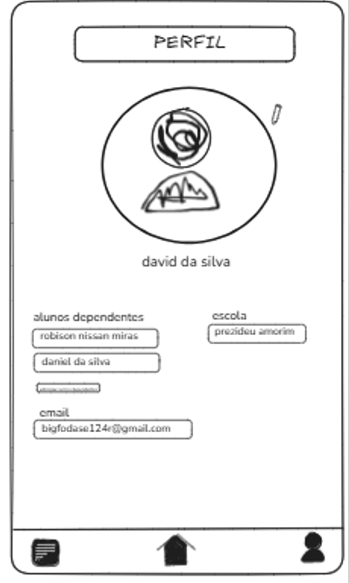

# Lanche & Co - Documentação do Projeto

## Sumário

1. [Introdução](#introdução)
2. [Objetivos](#objetivos)
3. [Funcionalidades e Recursos](#funcionalidades-e-recursos)
    - [2.1 Funcionalidades para Pais](#21-funcionalidades-para-pais)
    - [2.2 Funcionalidades para Nutricionistas](#22-funcionalidades-para-nutricionistas)
    - [2.3 Funcionalidades para Gerentes](#23-funcionalidades-para-gerentes)
    - [2.4 Integração com Gamificação](#24-integração-com-gamificação)
4. [Arquitetura do Sistema](#arquitetura-do-sistema)
    - [3.1 Visão Geral](#31-visão-geral)
    - [3.2 Tecnologias Utilizadas](#32-tecnologias-utilizadas)
    - [3.3 Componentes Principais](#33-componentes-principais)
    - [3.4 Fluxo de Dados](#34-fluxo-de-dados)
    - [3.5 Segurança](#35-seguranca)
    - [3.6 Escalabilidade e Resiliência](#36-escalabilidade-e-resiliência)
5. [Fluxo de Telas](#5-fluxo-de-telas)
   - [Figura 01 - Fluxo de Telas do Aplicativo Lanche&Co.](#figura-01-fluxo-de-telas-do-aplicativo-lanche-co)
    - [4.1 Tela Inicial (Splash Screen)](#41-tela-inicial-splash-screen)
    - [4.2 Tela de Login](#42-tela-de-login)
    - [4.3 Tela de News (Notícias)](#43-tela-de-news-noticias)
    - [4.4 Tela de Chat](#44-tela-de-chat)
    - [4.5 Tela de Perfil](#45-tela-de-perfil)
    - [4.6 Navegação Geral](#46-navegação-geral)
    - [Considerações sobre o Fluxo de Telas](#considerações-sobre-o-fluxo-de-telas)

---

## Introdução

O aplicativo **Lanche & Co** tem como objetivo fornecer aos pais informações detalhadas e acessíveis sobre a alimentação de seus filhos nas escolas parceiras. Com foco em promover hábitos saudáveis e aumentar a confiança dos pais na qualidade dos serviços oferecidos, o app inclui ferramentas de monitoramento nutricional, comunicação com nutricionistas e funcionalidades administrativas para gerenciamento das unidades.

A solução visa atender três principais grupos de usuários:
- **Pais:** que desejam acompanhar a alimentação de seus filhos de forma prática e interativa.
- **Nutricionistas:** que precisam gerenciar relatórios, feedbacks e comunicações personalizadas.
- **Gerentes Gerais:** responsáveis pelo controle e supervisão de todas as unidades e dados.

Com uma interface intuitiva e moderna, o app prioriza a experiência do usuário, alinhando gamificação e personalização para tornar o acompanhamento mais engajador.

---

## Objetivos

O aplicativo **Lanche & Co** tem como principais objetivos:

1. **Promover Transparência:**
   - Garantir que os pais tenham acesso detalhado às informações sobre o consumo alimentar dos seus filhos, como quantidade de calorias ingeridas e períodos de alimentação.

2. **Facilitar a Comunicação:**
   - Criar um canal direto e eficiente entre pais e nutricionistas, com suporte a mensagens rápidas e feedbacks personalizados.

3. **Otimizar a Gestão:**
   - Permitir que nutricionistas e gerentes gerais acompanhem de forma centralizada os dados dos alunos, enviem relatórios e gerenciem as informações de maneira prática.

4. **Incentivar Hábitos Saudáveis:**
   - Reforçar os valores da Lanche & Co como uma empresa voltada para a saúde e bem-estar, utilizando funcionalidades que destacam a qualidade da alimentação oferecida.

5. **Gamificar a Experiência:**
   - Tornar o acompanhamento dos pais mais envolvente, utilizando conquistas e indicadores que evidenciem o progresso das crianças.

---

## Funcionalidades e Recursos

O aplicativo **Lanche & Co** foi projetado para atender às necessidades de pais, nutricionistas e gerentes, garantindo uma experiência completa e intuitiva. Cada funcionalidade foi desenvolvida para reforçar o compromisso da empresa com a saúde e o bem-estar dos alunos, além de otimizar a comunicação entre os stakeholders.

---

### **2.1 Funcionalidades para Pais**

Os pais são um dos públicos principais do sistema. Suas funcionalidades foram pensadas para oferecer clareza e acessibilidade, promovendo uma experiência positiva que reforça a confiança na **Lanche & Co**. As principais funcionalidades incluem:

1. **Acompanhamento das Refeições:**
   - Os pais podem visualizar um relatório detalhado das refeições consumidas por seus filhos, com informações como calorias ingeridas e períodos (café da manhã, almoço, lanche da tarde).
   - Um sistema de marcação indica o status de cada refeição:
     - ✓ Refeição consumida.
     - ✕ Refeição não consumida.
     - - Período ainda não iniciado.
   - Essa funcionalidade reforça a imagem de saúde e cuidado, alinhada aos valores da empresa.

2. **Chat com Nutricionista:**
   - Os pais podem se comunicar diretamente com a nutricionista responsável, enviando perguntas e dúvidas sobre a dieta de seus filhos.
   - Mensagens específicas podem ser vinculadas a contextos (ex.: “pergunta sobre o café da manhã”), simulando a funcionalidade de "responder" de aplicativos como WhatsApp.
   - Para evitar sobrecarga, há um sistema de cooldown ajustável, garantindo organização e eficiência no atendimento.

3. **Notificações Personalizadas:**
   - Recebimento de alertas sobre avisos importantes, eventos ou feedbacks relacionados ao desempenho e alimentação dos filhos.
   - As notificações são exibidas na home e armazenadas no histórico para fácil consulta.

4. **Confirmação de Presença em Eventos:**
   - Permite que os pais confirmem a participação de seus filhos em eventos escolares diretamente pelo aplicativo.
   - A interface é simples: ao clicar no evento, surge uma tela de confirmação, promovendo praticidade.

5. **Widget de Conquistas:**
   - Apresenta as conquistas do aluno no acompanhamento alimentar, reforçando um sentimento de exclusividade para os pais.
   - Exemplo: “Seu filho consumiu refeições balanceadas em todos os períodos da semana!”.

---

### **2.2 Funcionalidades para Nutricionistas**

As nutricionistas têm um papel fundamental no sistema, utilizando as ferramentas do aplicativo para gerenciar a alimentação dos alunos e se comunicar com os pais. Suas funcionalidades incluem:

1. **Gestão do Perfil dos Alunos:**
   - Acesso aos dados individuais de cada aluno, incluindo restrições alimentares, especificações nutricionais e histórico de refeições.
   - Um perfil consolidado pode ser acessado rapidamente pela aba "Alunos".

2. **Relatórios Personalizados:**
   - Geração de relatórios com análises detalhadas, como padrões alimentares e conformidade com dietas sugeridas.
   - Esses relatórios ajudam na elaboração de planos mais eficazes e na comunicação com os pais.

3. **Envio de Feedbacks:**
   - A nutricionista pode enviar feedbacks individuais para os pais, selecionando o aluno e redigindo mensagens personalizadas ou utilizando mensagens padrão pré-configuradas.
   - Há uma funcionalidade para criar, editar e excluir feedbacks padrão, otimizando o envio em larga escala.

4. **Atualizações na Home:**
   - Capacidade de adicionar avisos importantes, fotos do buffet e comunicados gerais diretamente na tela inicial dos pais.
   - Facilita a transparência e o engajamento entre a nutricionista e os responsáveis.

5. **Chat Direto com Pais:**
   - Uma funcionalidade para responder dúvidas específicas dos pais de forma eficiente.
   - Inclui um histórico de mensagens para manter o contexto das interações.

---

### **2.3 Funcionalidades para Gerentes**

Os gerentes gerais possuem o maior nível de acesso dentro do sistema. Suas funcionalidades foram desenvolvidas para oferecer controle administrativo e estratégico, promovendo a visão ampla necessária para gerenciar múltiplas unidades.

1. **Gerenciamento de Usuários:**
   - Acesso às informações de pais, alunos e nutricionistas de todas as unidades.
   - Possibilidade de visualizar e alterar permissões de acesso, garantindo flexibilidade na gestão.

2. **Relatórios Gerenciais:**
   - Relatórios automáticos com métricas consolidadas de todas as unidades, incluindo:
     - Taxa de consumo de refeições.
     - Feedbacks mais enviados.
     - Eventos com maior participação.
   - Esses dados ajudam a identificar padrões e tomar decisões estratégicas.

3. **Controle de Conteúdo:**
   - Capacidade de gerenciar conteúdos exibidos na home das unidades, garantindo padronização e alinhamento à identidade da marca.

---

### **2.4 Integração com Gamificação**

Embora o público principal do aplicativo seja os pais, a gamificação foi integrada de forma leve e direcionada. 

1. **Widgets de Conquistas:**
   - Apresentados nos perfis dos alunos, destacando marcos como "Refeições completas da semana" ou "Dieta 100% balanceada".
   - Estimula os pais a acompanharem com mais frequência os relatórios alimentares.

2. **Eventos e Participações:**
   - Os eventos escolares podem incluir conquistas exclusivas para os alunos, destacando sua presença e envolvimento.
   - Exemplos: “Participou de 5 eventos consecutivos!” ou “Presente no workshop de culinária saudável!”.

---

Essa seção detalha cada funcionalidade de forma abrangente, demonstrando como cada grupo de usuários se beneficia do sistema. Agora podemos prosseguir para a **Arquitetura**.

## **3. Arquitetura do Sistema**

A arquitetura do sistema foi projetada para oferecer escalabilidade, segurança e uma experiência de uso fluida para todos os grupos de usuários. Ela é baseada em uma estrutura modular, utilizando tecnologias modernas e alinhadas com as melhores práticas do mercado. Abaixo estão os componentes e aspectos mais relevantes da arquitetura:

### **3.1 Visão Geral**

O sistema segue uma arquitetura baseada em microsserviços, separando cada funcionalidade principal em serviços independentes. Isso permite escalabilidade horizontal e maior flexibilidade no desenvolvimento e manutenção.

- **Frontend:** Responsável pela interface de interação com os usuários (pais, nutricionistas e gerentes).
- **Backend:** Gerencia a lógica de negócios, autenticação e comunicação entre os microsserviços.
- **Banco de Dados:** Centraliza informações críticas como perfis de usuários, dados nutricionais e relatórios.
- **Integrações:** Conecta o sistema a APIs externas para serviços adicionais (ex.: notificações push, sistemas de pagamento).

---

### **3.2 Tecnologias Utilizadas**

O sistema utiliza um conjunto de ferramentas e frameworks modernos para garantir alto desempenho e confiabilidade:

- **Frontend:**
  - **React**: Framework JavaScript para construção de interfaces dinâmicas e responsivas.
  - **TailwindCSS**: Biblioteca para estilização, permitindo um design elegante e consistente.
  - **Redux**: Gerenciamento centralizado de estado para maior controle de interações e dados.

- **Backend:**
  - **Node.js** com **Express**: Plataforma para construir APIs rápidas e escaláveis.
  - **GraphQL**: Protocolo para consultas eficientes, reduzindo a sobrecarga de dados.
  - **NestJS** (opcional): Framework modular para estruturação organizada de serviços.

- **Banco de Dados:**
  - **MongoDB**: Banco de dados NoSQL para armazenamento flexível e escalável.
  - **Redis**: Cache para melhorar o desempenho em consultas frequentes.

- **Infraestrutura:**
  - **Docker**: Para containerização e implantação padronizada em diferentes ambientes.
  - **Kubernetes**: Orquestração de microsserviços para alta disponibilidade.
  - **AWS (Amazon Web Services)**: Serviços de nuvem para hospedagem, banco de dados e armazenamento.

---

### **3.3 Componentes Principais**

1. **Frontend:**
   - Cada tipo de usuário possui uma interface personalizada, carregada dinamicamente com base no perfil.
   - Comunicação com o backend via APIs REST e GraphQL para maior eficiência de dados.
   - Implementação responsiva para garantir acessibilidade em dispositivos móveis e desktops.

2. **Backend:**
   - Implementa lógica de negócios central, como regras para notificações, relatórios personalizados e validações.
   - Serviço de autenticação utilizando **JWT (JSON Web Tokens)** para sessões seguras.
   - Microsserviços separados para funcionalidades críticas:
     - **Gerenciamento de Usuários**
     - **Processamento de Relatórios**
     - **Sistema de Chat**

3. **Banco de Dados:**
   - Estrutura de coleções no MongoDB para armazenar:
     - Dados de perfis (pais, alunos, nutricionistas).
     - Registros de refeições e relatórios alimentares.
     - Histórico de mensagens no chat.
   - Índices otimizados para consultas rápidas em tabelas volumosas.

4. **APIs Externas e Integrações:**
   - **Firebase Cloud Messaging** para envio de notificações push.
   - **Twilio** para comunicação via SMS em casos críticos (ex.: lembretes importantes).
   - **Google Calendar API** para sincronização de eventos escolares.

---

### **3.4 Fluxo de Dados**

O fluxo de dados no sistema é projetado para minimizar latência e maximizar a segurança:

1. **Autenticação e Login:**
   - O usuário insere suas credenciais, que são validadas pelo backend.
   - Após validação, um token JWT é gerado e enviado para o cliente.

2. **Consulta e Atualização de Dados:**
   - O frontend envia solicitações ao backend via GraphQL para consultar ou atualizar informações.
   - O backend valida permissões e processa a lógica necessária antes de acessar o banco de dados.

3. **Notificações:**
   - Eventos como "atualização de relatório" ou "novos avisos" disparam notificações em tempo real via Firebase.

4. **Chat:**
   - Mensagens enviadas pelo frontend são roteadas para o backend, armazenadas no banco de dados e entregues ao destinatário.

---

### **3.5 Segurança**

A segurança é um dos pilares fundamentais do sistema, com medidas implementadas em todas as camadas:

- **Criptografia:** Dados sensíveis, como senhas e tokens, são armazenados utilizando algoritmos de hash robustos (ex.: bcrypt).
- **Autorização Baseada em Perfis:** Cada solicitação é verificada para garantir que o usuário tenha permissões adequadas.
- **Monitoramento e Logs:** Ferramentas como **Elastic Stack** monitoram eventos e identificam atividades suspeitas.
- **Certificados SSL:** Garantem que toda comunicação entre clientes e servidores seja criptografada.

---

### **3.6 Escalabilidade e Resiliência**

- O uso de Kubernetes permite o escalonamento automático de serviços durante picos de uso, como períodos de login em massa.
- Estratégias de failover garantem a continuidade do serviço em caso de falhas de hardware ou software.

---

Caso precise de ajustes ou mais detalhamentos, informe! Do contrário, seguiremos para a próxima parte: **Casos de Uso**.

## **4. Fluxo de Telas**

O design do fluxo de telas reflete a experiência do usuário desde a abertura do aplicativo até a interação completa com suas principais funcionalidades. A seguir, detalhamos as telas apresentadas na **Figura 01** e explicamos o papel de cada uma no contexto do sistema.

### **Figura 01 - Fluxo de Telas do Aplicativo Lanche&Co.**

---

### **4.1 Tela Inicial (Splash Screen)**

Figure 02 - primeira tela
 
 

 
 
Source: Produced by the authors (2024)

 

**Descrição:**  
A tela inicial é a primeira interface visualizada pelo usuário ao abrir o aplicativo.  
- Exibe o logotipo do **Lanche&Co.**, reforçando a identidade visual da marca.  
- Possui um botão "Começar" para iniciar a navegação no app.  
- Propósito principal: criar uma experiência de boas-vindas e estabelecer uma conexão com o usuário antes de carregar o restante do conteúdo.

---

### **4.2 Tela de Login**

Figure 03 - tela de login
 
 

 
 
Source: Produced by the authors (2024)

 

**Descrição:**  
A tela de login permite que usuários registrados acessem suas contas e personalizem sua experiência no app.  
- **Campos disponíveis:**  
  - **E-mail:** para autenticação.  
  - **Senha:** protegida para maior segurança.  
- **Funcionalidades adicionais:**  
  - Botão "Esqueci minha senha" para recuperação de credenciais.  
  - Botão "Cadastrar" para novos usuários.  
- Fluxo principal: após a autenticação bem-sucedida, o usuário é redirecionado para a página inicial.

---

### **4.3 Tela de News (Notícias)**

Figure 04 - tela de news
 
 

 
 
Source: Produced by the authors (2024)

 

**Descrição:**  
Esta tela centraliza atualizações e novidades fornecidas pelo serviço, como eventos escolares ou alterações nos cardápios.  
- **Elementos:**  
  - Uma lista cronológica de "notícias" ou "buffets" com imagens e descrições.  
  - Itens informativos como "novos pratos adicionados" ou "eventos especiais".  
- Navegação: os usuários podem clicar em uma notícia para obter mais detalhes (se aplicável).  
- Importância: serve como o ponto de entrada para as principais comunicações da plataforma.

---

### **4.4 Tela de Chat**

Figure 05 - tela de chat
 
 

 
 
Source: Produced by the authors (2024)

 

**Descrição:**  
Permite que os usuários conversem diretamente com nutricionistas ou outros responsáveis pela alimentação escolar.  
- **Componentes:**  
  - Interface de mensagens no estilo de um aplicativo de chat convencional.  
  - Mensagens são organizadas de forma cronológica.  
  - Fotos de perfil identificam os participantes do chat.  
- Aplicação prática: os pais podem discutir questões alimentares ou solicitar informações personalizadas.

---

### **4.5 Tela de Perfil**

Figure 06 - tela de perfil
 
 

 
 
Source: Produced by the authors (2024)

 

**Descrição:**  
Centraliza as informações pessoais do usuário e permite ajustes no perfil.  
- **Campos exibidos:**  
  - Nome do responsável.  
  - Lista de dependentes (alunos vinculados ao perfil).  
  - Nome da escola associada.  
  - Endereço de e-mail cadastrado.  
- Funcionalidades:  
  - Botão de edição para ajustes rápidos no perfil.  
- Relevância: garante que o sistema mantenha informações atualizadas para personalização de notificações e relatórios.

---

### **4.6 Navegação Geral**

**Descrição:**  
A navegação entre telas é facilitada por uma barra de ícones fixa na parte inferior de cada interface:  
- **Ícone 1:** Acesso rápido à seção de "Notícias".  
- **Ícone 2:** Voltar para a página inicial.  
- **Ícone 3:** Acesso direto ao perfil do usuário.

---

### **Considerações sobre o Fluxo de Telas**

O fluxo foi projetado para:  
1. Ser **intuitivo e direto**, reduzindo a curva de aprendizado para novos usuários.  
2. Promover **acesso rápido às informações mais relevantes**.  
3. Facilitar **interações personalizadas**, como chats e notícias específicas para cada perfil.

---

Caso tenha mais imagens ou queira complementações, posso continuar estruturando o restante da documentação.

